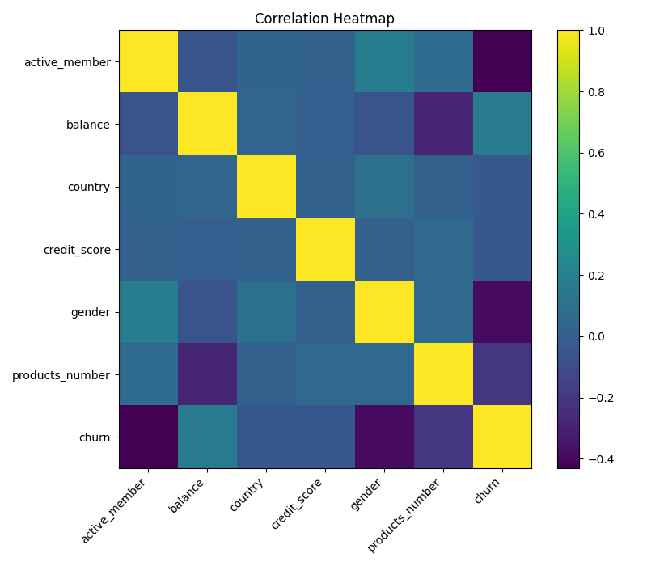

# Bank Customer Churn Prediction

This repository contains a small end-to-end analysis on predicting **customer churn** for a bank using classical machine-learning techniques.  
The focus is on understanding the dataset, visualizing important patterns, and establishing a simple baseline model using **Logistic Regression**.

---

## Dataset Overview

The dataset includes basic customer information such as:

- **Credit Score**
- **Balance**
- **Number of Products**
- **Gender**
- **Country**
- **Active Membership**
- **Churn (target variable)**

The goal is to classify whether a customer is likely to leave the bank.

---

## Correlation Analysis

A correlation heatmap was created to quickly inspect relationships between numerical variables and churn.  
This helps in understanding whether the target has any strong linear association with the features.

### 📌 Correlation Heatmap  
(Generated from `df.corr()`)

Observations:

- None of the features have strong correlation with churn.
- `active_member` and `gender` show moderate negative correlation.
- Overall, the dataset does not exhibit strong linear patterns.

This suggests that models relying purely on linear relationships may not perform extremely well.

---

## Boxplot Overview (Outlier Check)

To get an idea of the spread and detect any obvious outliers, boxplots were created for each feature.

### 📌 Boxplots

These visuals help confirm that certain variables (especially **balance** and **credit_score**) have noticeable spread and potential extreme values.

---

## Model Used: Logistic Regression

A simple **Logistic Regression** model was used as the baseline classifier.

### Why Logistic Regression?

- Easy to interpret  
- Works well as a baseline  
- Outputs probability scores (useful for ROC-AUC)

### Logistic Regression Formula

The model estimates:

\[
P(\text{churn}=1) = \\frac{1}{1 + e^{-(β_0 + β_1x_1 + β_2x_2 + ... + β_nx_n)}}
\]

---
Conclusion

The Logistic Regression model provides a reasonable baseline, but due to weak linear relationships in the dataset, its performance is naturally limited.

Models that usually work better on this type of non-linear data include:

Random Forest

XGBoost

Gradient Boosting

CatBoost

These can capture complex patterns that simple linear models cannot.